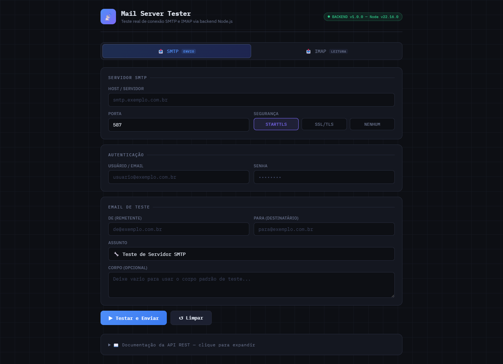

# 📡 Mail Server Tester

Aplicação Node.js simples para testar servidores **SMTP** e **IMAP** via interface web e API REST. Ideal para debug, verificação de credenciais e testes rápidos em ambientes de desenvolvimento.

Principais recursos:

- Testes de conexão e autenticação SMTP (envio de e-mail de teste)
- Testes de conexão IMAP (listagem de pastas/caixas)
- Endpoints REST para integração com scripts e CI
- Interface web leve para testes manuais

## Demonstração

Abaixo uma captura de tela da interface web (arquivo em `docs/screen.png`):



> Observação: se estiver visualizando o README no GitHub/VS Code, o caminho `docs/screen.png` deve mostrar a imagem automaticamente.

## Instalação

```bash
npm install
```

## Iniciar

```bash
npm start
# ou para desenvolvimento com auto-reload:
npm run dev
```

Acesse: **<http://localhost:3000>**

---

## API REST

### `POST /api/smtp/test`

Testa conexão, autenticação e envia um email de teste.

```json
{
  "host": "smtp.exemplo.com",
  "port": 587,
  "security": "TLS",
  "user": "usuario@exemplo.com",
  "pass": "senha",
  "from": "de@exemplo.com",
  "to": "para@exemplo.com",
  "subject": "Assunto opcional",
  "body": "Corpo opcional"
}
```

**security:** `"SSL"` (porta 465) | `"TLS"` / STARTTLS (porta 587) | `"NONE"` (porta 25)

---

### `POST /api/imap/test`

Testa conexão, autenticação e lista caixas de entrada.

```json
{
  "host": "imap.exemplo.com",
  "port": 993,
  "security": "SSL",
  "user": "usuario@exemplo.com",
  "pass": "senha"
}
```

---

### `GET /api/health`

Retorna status do servidor.

---

## Exemplo com cURL

```bash
# SMTP
curl -X POST http://localhost:3000/api/smtp/test \
  -H "Content-Type: application/json" \
  -d '{"host":"smtp.gmail.com","port":587,"security":"TLS","user":"seu@gmail.com","pass":"senha_app","from":"seu@gmail.com","to":"destino@email.com"}'

# IMAP
curl -X POST http://localhost:3000/api/imap/test \
  -H "Content-Type: application/json" \
  -d '{"host":"imap.gmail.com","port":993,"security":"SSL","user":"seu@gmail.com","pass":"senha_app"}'
```

> **Dica Gmail:** use uma [Senha de App](https://myaccount.google.com/apppasswords) em vez da senha principal.

---

## Porta personalizada

```bash
PORT=8080 npm start
```
